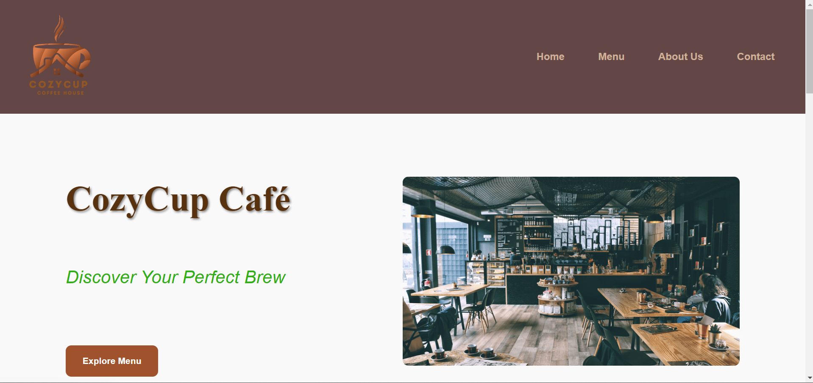
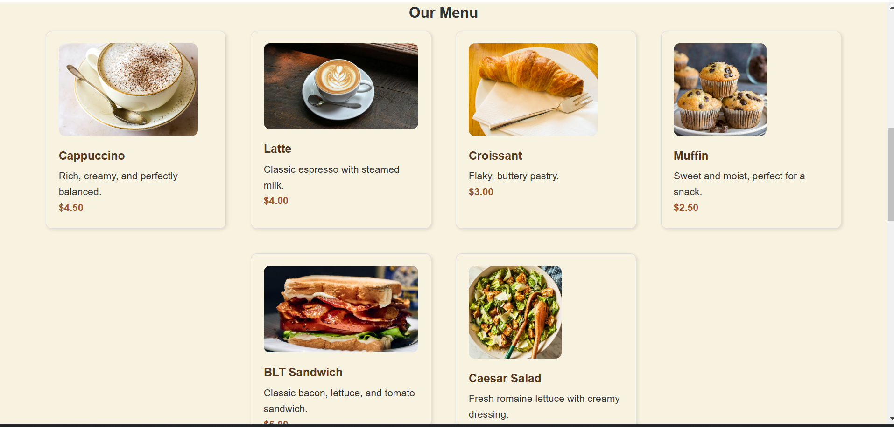
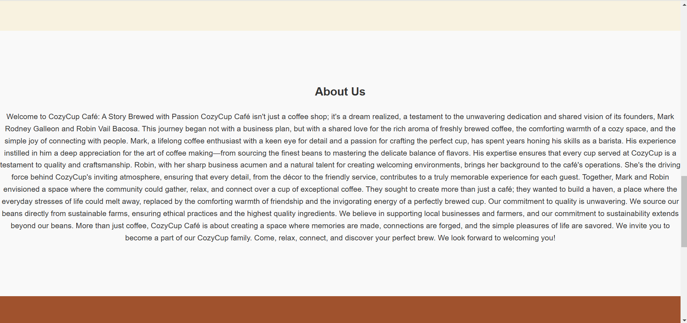

# Cozy Cup Cafe

## Project Description

Cozy Cup Cafe is an innovative and user-friendly platform designed to provide customers with a seamless coffee shop experience. The project includes an intuitive interface, detailed menu, and features that enhance customer satisfaction.

## Features

- Intuitive user interface for easy navigation
- Online ordering system
- Loyalty rewards program
- Social media integration
- Stunning visuals and a modern design

## Screen Captures

This page shows the header and the main page of the website.

This image shows the menu of the cafe

This image shows the story behind the business and introducing the owners of the Cozy Cup Cafe.

In this image, it shows the background of the owners and also their pictures. Their names are also clickable that will lead the user to their Facebook accounts.

## About the Authors

**BACOSA & GALLEON**

### Name: **ROBIN VAIL BACOSA & MARK RODNEY GALLEON**

### Email: **bacosarobinvail@gmail.com**

## Social Media Links

